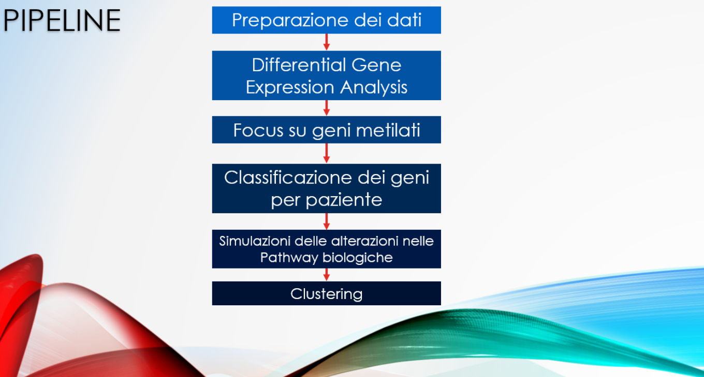
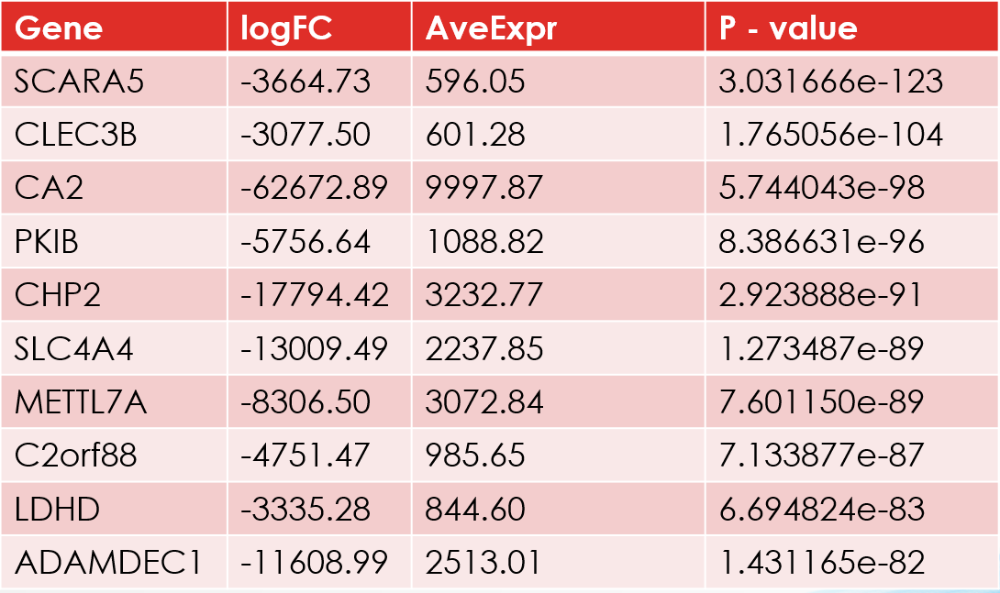
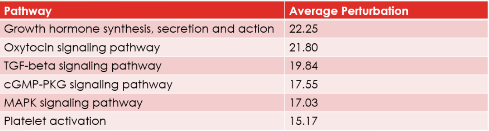
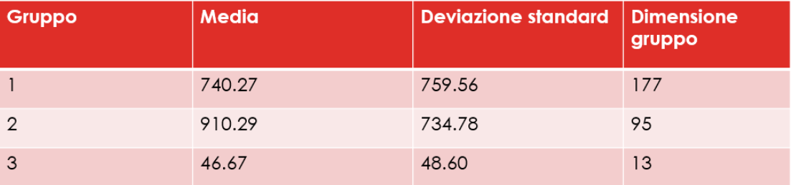
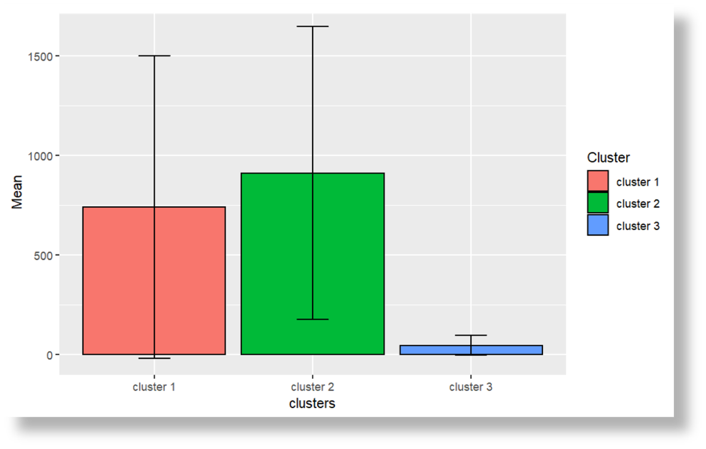
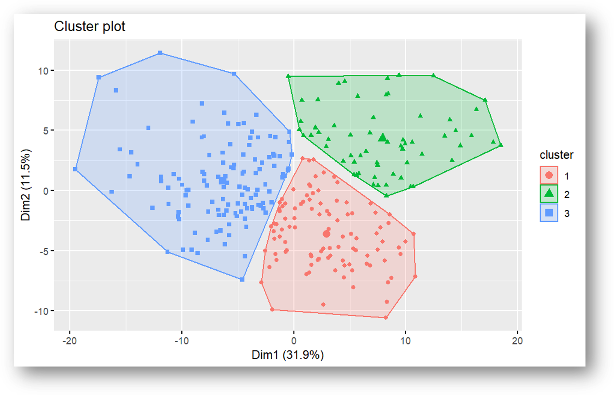

# Analisi e valutazione dell’impatto della metilazione sulle pathway biologiche in pazienti affetti da cancro al colon
Repository contenente il progetto di tesi triennale in informatica.
In particolare:
* **pipeline.Rmd** contiene il codice della pipeline presentata nella tesi.
* **consider_covariates.Rmd** è un'estensione del lavoro fatto per la tesi, andando a considerare nei vari passi della pipeline gli effetti di alcune covariate (variabili cliniche).
* **tesi_Lorenzo_Modica_triennale_informatica.pdf** è il pdf della tesi.
* **presentazione_tesi.pptx** è il powerpoint della dissertazione.

L'intento del progetto è di studiare l’impatto della metilazione sul funzionamento delle pathway biologiche e come tali disregolazioni possano
condurre all’individuazione di casi in cui il tumore agisce in maniera
più (o meno) letale.
A tal fine, viene proposta una pipeline di analisi in cui, partendo
da dati clinici di pazienti affetti da cancro al colon e pazienti sani,
vengono effettuate una serie di fasi atte alla predizione di possibili
disfunzioni nelle pathway biologiche e alla ricerca di sottogruppi in
cui la sopravvivenza dei pazienti, intesa come il periodo di vita medio
dal momento della diagnosi, differisce particolarmente.

# 📃 Data
Il dataset usato nella pipeline può essere trovato al seguente link: https://portal.gdc.cancer.gov/projects/TCGA-COAD

# 🧬 Pipeline

  

# 📈 Risultati
Considerando tutti i passaggi che compongono la pipeline effettuata, si possono trarre risultati da tre fasi distinte: 
* Dall’analisi dei geni differenzialmente espressi. 
* Dalla simulazione delle perturbazioni delle pathway. 
* Dal clustering per valutare differenze, in termini di sopravvivenza dei pazienti, tra le partizioni ottenute.

A seguire, vengono mostrati i 10 geni differenzialmente espressi in maniera più significativa, ovvero con i p-value minori.

  

Il gene col minor p-value, SCARA5, è stato classificato come oncosoppressore, risultando inibito in presenza di cancro del colon-retto [1]. Difatti, nell'analisi effettuata tale gene risulta sottoespresso in maniera significativa.

Nella tabella successiva vengono elencate le pathway che, in seguito alle simulazioni, ottengono, in media, valori
di perturbazione inferiori.

  

Sono stati applicati diversi approcci di clustering:
* Clustering partizionale (k-means) sull’Activity Score degli endpoints.
* Clustering gerarchico sull’Activity Score degli endpoints.
* Clustering gerarchico sull’Activity Score delle pathways.
* Clustering gerarchico sul valore di perturbazione degli endpoints (Pearson).
* Clustering gerarchico sul valore di perturbazione degli endpoints (Spearman).
* Clustering gerarchico sui valori di perturbazione delle pathway.

Ad esempio, dall'applicazione del clustering gerarchico sull’Activity Score degli endpoints si ottengono i seguenti 3 gruppi.

  

I risultati evidenziano delle differenze tra i
gruppi, in particolar modo tra il secondo e il terzo cluster, le cui sopravvivenze medie sono rispettivamente di 910.29 e 46.67 giorni. 

  

I tre gruppi trovati, come si può notare nell'immagine sotto, risultano essere separati in maniera abbastanza netta nella rappresentazione bidimensione ottenuta dall'applicazione della Principal Component Analysis sul dataset dei valori di activity score.

  

# 👁‍🗨 Conclusione
Dalle analisi effettuate e dai risultati ottenuti si evince che la metilazione, influendo sull’espressione dei geni, porta a sostanziali alterazioni delle pathway.
Tramite queste alterazioni è possibile trovare gruppi di pazienti che,
dal momento della diagnosi, riescono a sopravvivere, mediamente,
più a lungo e altri, invece, caratterizzati da una bassa sopravvivenza.
Quindi, considerando i soli geni metilati e differenzialmente espressi
rispetto ad un gruppo di controllo, si riescono a trovare differenze nell’alterazione delle pathway che permettono di associare ogni paziente
ad un sottogruppo.
Ciò evidenzia un probabile ruolo di rilievo della metilazione nel tumore al colon, come mostrato in vari studi condotti in questo settore.

# 🔗 Reference
[1]  Liu, J.& Zeng, Menglu & Shi, PC & Cao, YP & Zhang, JL
& Xie, YP. (2020). SCARA5 is a Novel Biomarker in Colorectal Cancer by Comprehensive Analysis. Clinical Laboratory. 66.10.7754/Clin.Lab.2019.191015.
